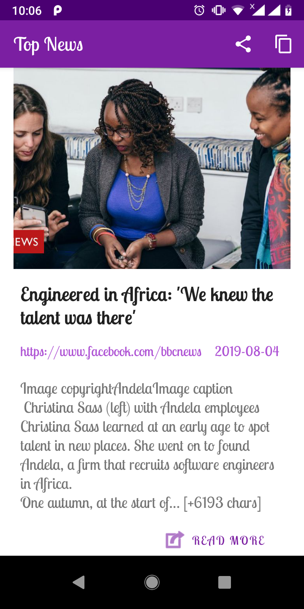
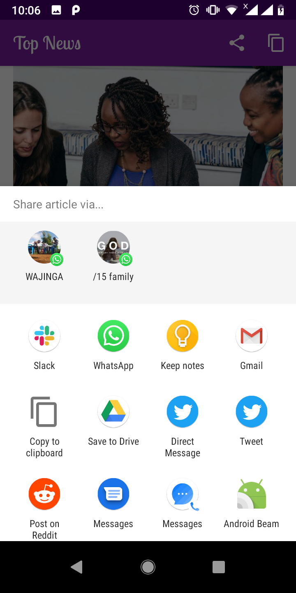

[](https://circleci.com/gh/petermwash/Top-News/tree/develop)
[](https://codeclimate.com/github/petermwash/Top-News/maintainability)

# Top-News

`Top News` is a news application that updates user on the latest news from various sources all over the world. It gives the user an option to view news updates for five locations by default which are `NewYork`, `Lagos`, `Nairobi`, `Kampala` and `Kigali`.
In addition to that, one can view international headlines based on the above location, share news articles with user's contacts or copy the url and the ability to operate offline.

## Screenshots
 | 


 | 

## Getting Started and Installation

1. Clone this repository to your local machine.
`git clone https://github.com/petermwash/Top-News.git`

2. Open the project in Android Studio; under the file menu select open, then select an existing project. Navigate to the folder you cloned then open the project.

4. Get an `API KEY` from [NewsApi](https://newsapi.org) and add the key to your `gradle.properties` file in your home directory under `.gradle` directory.

5. Run the app on an emulator or on you Android device.

Enjoy the app 😄.

### Prerequisites

1. [Set up Android Studio](https://developer.android.com/studio/install)

2. [Enable Kotlin in Android Studio](https://medium.com/@elye.project/setup-kotlin-for-android-studio-1bffdf1362e8)

3. [Run application on emulator](https://developer.android.com/studio/run/emulator)

4. [Run application on android device](https://developer.android.com/studio/run/device)


## Running the tests

1. Use these commands to run tests on your terminal
`./gradlew test` or `./gradlew jacocoTestReport`.


NB: Ensure you have either an emulator running or an Android device connected when running instrumentation tests.

## Architecture pattern used
* Model View ViewModel (MVVM)

## Consumed API Endpoints

```
    https://newsapi.org/v2/everything?q={query}&apiKey={key}
```

```
    https://newsapi.org/v2/top-headlines?sources={source}&apiKey={key}
```

## Technology Used

* [Android](https://www.android.com/) - Operating System.
* [Kotlin](https://kotlinlang.org/) - Programming language.
* [Coroutines](http://kotlinlang.org/docs/reference/coroutines.html) - For asynchronous and event-based functionality.
* [Retrofit](https://square.github.io/retrofit/) - For Networking.
* [Glide](https://bumptech.github.io/glide/) - For image processing.
* [Room](https://developer.android.com/topic/libraries/architecture/room) - For local database.
* [CoroutineWorker](https://github.com/Autodesk/coroutineworker) - Support coroutine background thread usage.
* [Google Java Style](https://google.github.io/styleguide/javaguide.html)

## Versioning
1.0

## Authors
[Peter Mwaura](https://github.com/petermwash)


## Credits
Thanks to the [NewsAPI.org](https://newsapi.org) team for availing the service.
